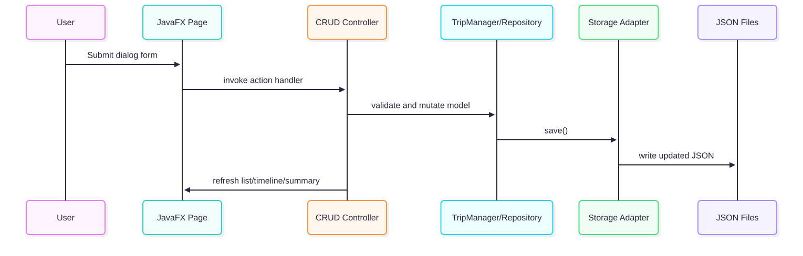

# Voyage Planner Developer Guide

This guide explains how Voyage Planner is put together, where the main responsibilities live, and what to check when you change the code.

Version: 1.0  
Last Updated: 2026-04-17

## Table of Contents

1. [Prerequisites](#prerequisites)
2. [Architecture](#architecture)
3. [Product Screens](#product-screens)
4. [Component Map](#component-map)
5. [Implementation](#implementation)
   1. [Entry Point](#entry-point)
   2. [UI Layer](#ui-layer)
   3. [Domain Layer](#domain-layer)
   4. [Persistence Layer](#persistence-layer)
6. [Data and Storage](#data-and-storage)
7. [Testing](#testing)
8. [Contribution Workflow](#contribution-workflow)
9. [Definition of Done](#definition-of-done)

## Prerequisites

Before you work on the project, make sure you have:

- Java 21
- Git
- Gradle wrapper support
- A local clone of this repository

Project stack:

- Java 21
- JavaFX
- Gson
- JUnit 5

For related design context, use:

- `docs/README.md`
- `docs/SDD.md`
- `docs/API.md`

## Architecture

Voyage Planner follows a layered monolith structure.
UI code collects user input, controllers coordinate actions, domain classes enforce rules, and storage classes keep the JSON files in sync.

	

Why this structure works well:

- UI code stays focused on interaction and presentation.
- Business rules can be tested without JavaFX.
- Persistence can stay isolated from application logic.
- The app remains local-first and easy to run on a clean machine.

Common runtime flow:

	

## Product Screens

These screenshots help new contributors orient themselves quickly.

| Home Page | Trip Page | Activity Page |
|---|---|---|
|  |  |  |

## Component Map

| Area | Responsibility | Key classes |
|---|---|---|
| Bootstrap | Starts JavaFX and loads the main scene | `Launcher`, `Main` |
| Home workspace | Shows trips, summary panels, and page switching | `ui.MainWindow` |
| Trip workspace | Handles trip timeline, activities, and trip-level expenses | `ui.TripPage` |
| Activity workspace | Handles activity-level expense management | `ui.ActivityPage` |
| Trip orchestration | Add, edit, delete trips and refresh the home view | `ui.control.MainWindowTripCrudController` |
| Lookup orchestration | Manage countries and locations with reference checks | `ui.control.MainWindowLookupCrudController`, `ui.control.MainWindowReferenceInspector` |
| UI support | Shared dialog helpers and page-specific summary widgets | `ui.control.MainWindowDialogSupport`, `ui.control.HomeActivitySnapshotController` |
| Trip domain | Trip rules, overlaps, and persistence coordination | `trip.Trip`, `trip.TripManager` |
| Activity domain | Activity state and timeline data | `activity.Activity`, `filter.ActivityFilter`, `temporal.TimeInterval` |
| Expense domain | Expense data and repository behavior | `expense.Expense`, `expense.ExpenseRepository`, `expense.ExpenseManagable` |
| Lookup domain | Countries and locations | `country.Country`, `country.CountryRepository`, `location.Location`, `location.LocationRepository` |
| Persistence | JSON adapters and image path handling | `storage.JsonStorage`, `storage.CountryStorage`, `storage.LocationStorage`, `storage.ExpenseStorage`, `storage.ImageAssetStore`, `storage.LocalDateTimeAdapter` |

## Implementation

### Entry Point

The application starts in `Launcher`, which launches the JavaFX runtime.
`Main` then loads `MainWindow.fxml`, applies the theme, and shows the main window.

This split keeps startup simple and makes the JavaFX bootstrap easy to follow.

### UI Layer

`ui.MainWindow` is the top-level controller for the app.
It wires together repositories, domain services, and helper controllers, then switches between the home, trip, and activity views.

Key responsibilities:

- Load persisted data on startup.
- Refresh the trip list and activity summary.
- Route the user to the correct page.
- Show user-facing error and information dialogs.

`MainWindow` collaborates with these controllers:

- `MainWindowTripCrudController` for trip add/edit/delete flows
- `MainWindowLookupCrudController` for country and location management
- `MainWindowReferenceInspector` for dependency checks
- `MainWindowDialogSupport` for reusable dialog behavior
- `HomeActivitySnapshotController` for the home-page activity summary

The detail pages follow the same pattern:

- `ui.TripPage` focuses on trip-specific timeline, activity, and expense operations.
- `ui.ActivityPage` focuses on activity-specific expense operations.

### Domain Layer

The domain layer contains the rules that make Voyage Planner behave correctly.

Important classes:

- `trip.TripManager` handles trip creation, updates, overlap checks, and persistence coordination.
- `activity.Activity` stores activity information and the time range for a single activity.
- `expense.Expense` stores expense details and supports trip or activity association.
- `country.Country` and `location.Location` represent lookup data used by trips and activities.
- `temporal.TimeInterval` centralizes interval logic used for time validation and comparisons.
- `filter.ActivityFilter` supports filtering activities by type.

Design goals for the domain layer:

- Keep validation rules in one place.
- Avoid coupling business rules to JavaFX.
- Make the logic straightforward to unit test.

### Persistence Layer

Persistence is handled through the `storage` package.
These classes read and write JSON files and keep image references portable across machines.

Key classes:

- `JsonStorage` coordinates trip persistence and Gson adapters.
- `CountryStorage`, `LocationStorage`, and `ExpenseStorage` handle lookup and expense files.
- `ImageAssetStore` normalizes image paths and resolves imported images.
- `LocalDateTimeAdapter` serializes and deserializes date-time values consistently.

The storage layer is intentionally narrow:

- It should not depend on JavaFX.
- It should not contain UI rules.
- It should only deal with file format, parsing, and persistence concerns.

## Data and Storage

Runtime data is stored in:

- `data/trips.json`
- `data/countries.json`
- `data/locations.json`
- `data/expenses.json`
- `data/images/`

Behavior to keep in mind:

- Image references should be treated as part of the persisted data model.
- File paths may need normalization when the app loads older data.
- Missing or malformed data should be handled gracefully where possible.

If you need to reset local state:

1. Stop the app.
2. Back up the `data/` folder if you want to keep the current state.
3. Remove or repair the affected JSON files.
4. Restart the app and verify the data loads correctly.

## Testing

Current test coverage lives under:

- `src/test/java/activity/`
- `src/test/java/expense/`
- `src/test/java/filter/`
- `src/test/java/trip/`

Test classes currently include:

- `TripManagerTest`
- `TripTest`
- `ActivityTest`
- `ExpenseTest`
- `ActivityFilterTest`

Minimum checks before merge:

1. Run the unit test suite.
2. Launch the app and verify at least one end-to-end flow.
3. Check persistence by restarting the app after making changes.
4. Confirm deletion safeguards still block referenced countries and locations.

Useful regression scenarios:

- Trip add or edit with overlapping time ranges.
- Activity edit with an invalid time range.
- Expense removal after deleting a trip.
- Startup behavior when a local JSON file is malformed.

## Contribution Workflow

1. Create a feature branch.
2. Make focused changes in the relevant module.
3. Add or update tests for the behavior you changed.
4. Run the unit tests and a manual smoke test.
5. Update `docs/API.md`, `docs/SDD.md`, this guide, or `docs/userGuide.md` if behavior changed.
6. Open a pull request with the risk notes and validation evidence.

## Definition of Done

Use this checklist for non-trivial changes:

- [ ] Build succeeds from a clean checkout.
- [ ] Unit tests pass locally.
- [ ] Main user flow was verified manually.
- [ ] Save and reload behavior still works.
- [ ] Error handling still behaves correctly.
- [ ] Documentation was updated where needed.
- [ ] No layering violations were introduced.

You have reached the end of the developer guide.

To head back, click [here](./README.md)
