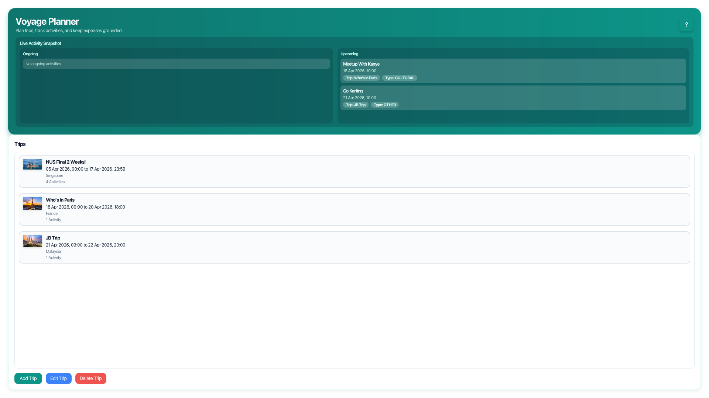
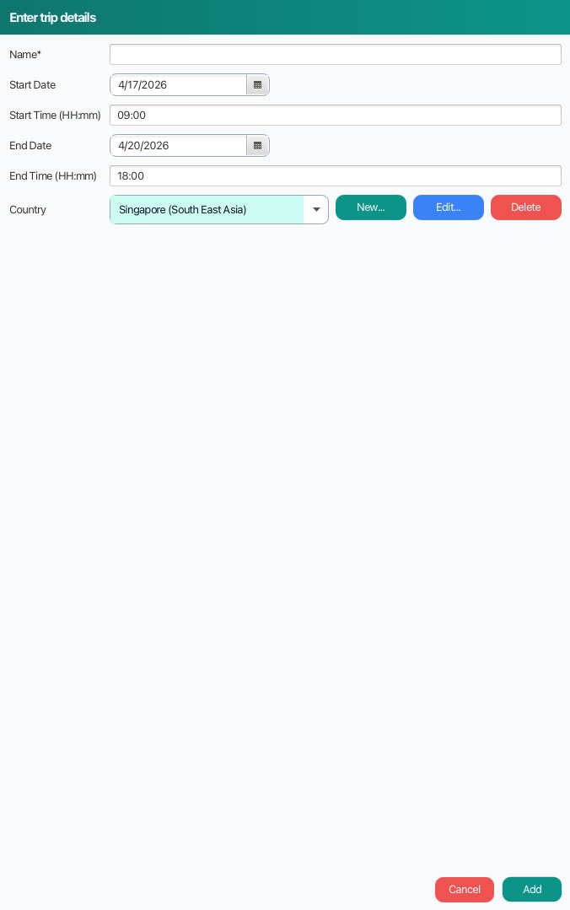
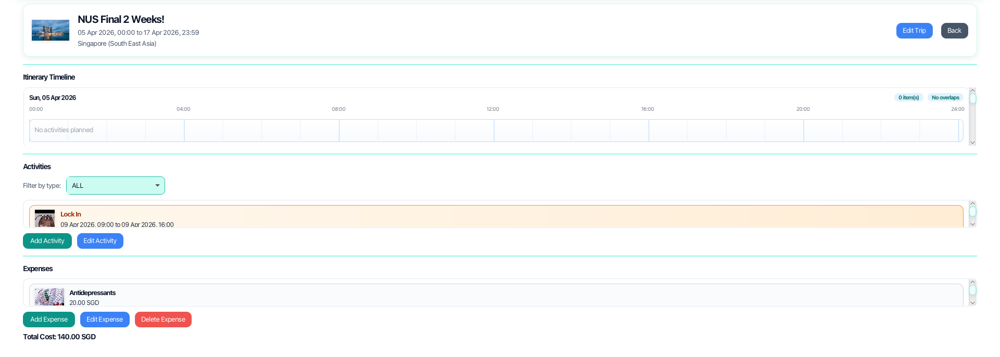
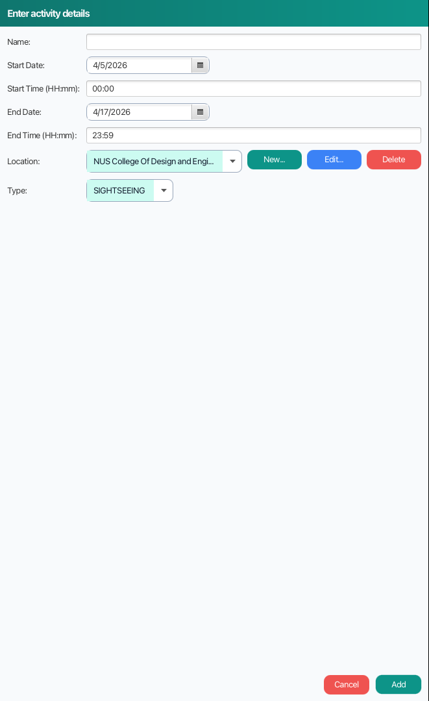
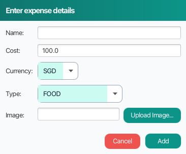

# Voyage Planner User Guide



Voyage Planner is a desktop app that helps you plan trips, activities, and expenses in one place.
It is made for users who want a clear itinerary and budget view without juggling multiple tools.


## Table of Contents

- [Getting Started](#getting-started)
- [Quick Start: Plan Your First Trip](#quick-start-plan-your-first-trip)
- [Using Voyage Planner](#using-voyage-planner)
  - [Home Page](#home-page)
  - [Trip Management](#trip-management)
  - [Activity Management (Inside a Trip)](#activity-management-inside-a-trip)
  - [Expense Management](#expense-management)
  - [Country and Location Management](#country-and-location-management)
- [Before You Save](#before-you-save)
- [Troubleshooting](#troubleshooting)
- [Data and Backup](#data-and-backup)

## Getting Started

### Requirements

- Java 21 or later
- Git (optional, if you are cloning from source)

### Launch the App

From the project root:

```bash
# Windows
gradlew.bat run

# macOS / Linux
./gradlew run
```

After the app opens, you should see:
- The Home page.
- The `Voyage Planner` title.
- The `Live Activity Snapshot` and `Trips` panel.

## Quick Start: Plan Your First Trip

### Step 1: Launch Voyage Planner

Run the app using the command above.


### Step 2: Create your first trip

1. Click `Add Trip`.
2. Fill in `Name`, `Start Date`, `Start Time`, `End Date`, `End Time`, and `Country`.
3. Click `Add`.

What happens next:
- The trip appears in the trip list.
- The trip is saved to local storage.



### Step 3: Open trip details

1. Double-click a trip card in the `Trips` list.

What happens next:
- Trip page opens.
- You can now manage itinerary, activities, and expenses.



### Step 4: Add one activity

1. In the trip page, click `Add Activity`.
2. Fill in name, date/time, location (optional), and type.
3. Click `Add`.

What happens next:
- Activity appears in `Activities` and `Itinerary Timeline`.



### Step 5: Add one expense

1. In the trip page, click `Add Expense`.
2. Fill in name, cost, currency, type, and optional image.
3. Click `Add`.

What happens next:
- Expense appears in the `Expenses` list.
- `Total Cost` is recalculated.



### End-to-End Workflow


## Using Voyage Planner

### Home Page

You can:
- Add, edit, and delete trips.
- Open a trip by double-clicking it.
- View ongoing and upcoming activities in `Live Activity Snapshot`.
- Click `?` for contextual help.

### Trip Management

#### Add Trip

1. Click `Add Trip`.
2. Enter required fields.
3. Click `Add`.

What happens next:
- Valid trip: it is created and saved.
- Invalid trip: an error alert explains what needs fixing.

#### Edit Trip

1. Select a trip.
2. Click `Edit Trip`.
3. Update fields.
4. Click `Save`.

What happens next:
- The trip updates and the list refreshes.

#### Delete Trip

1. Select a trip.
2. Click `Delete Trip`.

What happens next:
- Trip is removed.
- Related orphan expenses are cleaned automatically.

### Activity Management (Inside a Trip)

You can:
- Add and edit activities.
- Filter activities by type (`ALL` or specific type).
- Open activity details by double-clicking an activity.
- Review overlap highlights in timeline and list.

### Expense Management

You can manage expenses in two places:
- Trip page (trip-level and merged view)
- Activity page (activity-level)

Buttons you can use:
- `Add Expense`
- `Edit Expense`
- `Delete Expense`

What happens next:
- Expense lists update immediately.
- Totals refresh by currency.

### Country and Location Management

You manage countries and locations from the trip and activity dialogs.

1. In `Add/Edit Trip` or `Add/Edit Activity`, use selector row buttons:
   - `New...`
   - `Edit...`
   - `Delete`

What happens next:
- Selector options update immediately after changes.
- Deletion is blocked when an item is still referenced.

## Before You Save

### Trip

Required:
- Name
- Start date/time
- End date/time
- Country

Common things to watch for:
- Start after end
- Name already used by another trip
- Overlap with another trip

Helpful error messages:
- `Invalid trip: Trip start must not be after end`
- `Trip time conflict: Trip time conflict with existing trip: ...`

### Activity

Required:
- Name
- Start date/time
- End date/time

Optional:
- Location
- Type (defaults to the first selected option)

Common things to watch for:
- Start after end
- Invalid time text (fallback defaults may be applied)

Helpful error message:
- `Failed to edit activity: Start must not be after end`

### Expense

Required:
- Name
- Cost
- Currency
- Type

Optional:
- Image

Common things to watch for:
- Non-numeric cost
- Negative cost

Helpful error messages:
- `Failed to add expense: ...`
- `Failed to edit expense: ...`

## Troubleshooting

### The app says it could not load saved data

Cause:
- One of the JSON files in `data/` is missing, malformed, or unreadable.

What to do:
1. Back up your `data/` folder.
2. Check file content for valid JSON.
3. Restart the app.

### I cannot delete a country/location

Cause:
- It is still referenced by trips or activities.

What to do:
1. Remove or reassign dependent trips/activities first.
2. Retry deletion.

### My expense image does not appear

Cause:
- File path is invalid, file was moved, or import failed.

What to do:
1. Edit the expense.
2. Re-upload image.
3. Save again.

### I clicked edit/delete but nothing happened

Cause:
- No item is selected.

What to do:
1. Select the trip/activity/expense first.
2. Retry action.

### Timeline looks crowded

Cause:
- Activities overlap in time.

What to do:
1. Edit activity times.
2. Use activity filter to focus by type.

## Data and Backup

Your local data is stored in:
- `data/trips.json`
- `data/countries.json`
- `data/locations.json`
- `data/expenses.json`
- `data/images/`

Backup recommendation:
1. Close the app.
2. Copy the entire `data/` folder to a backup location.

